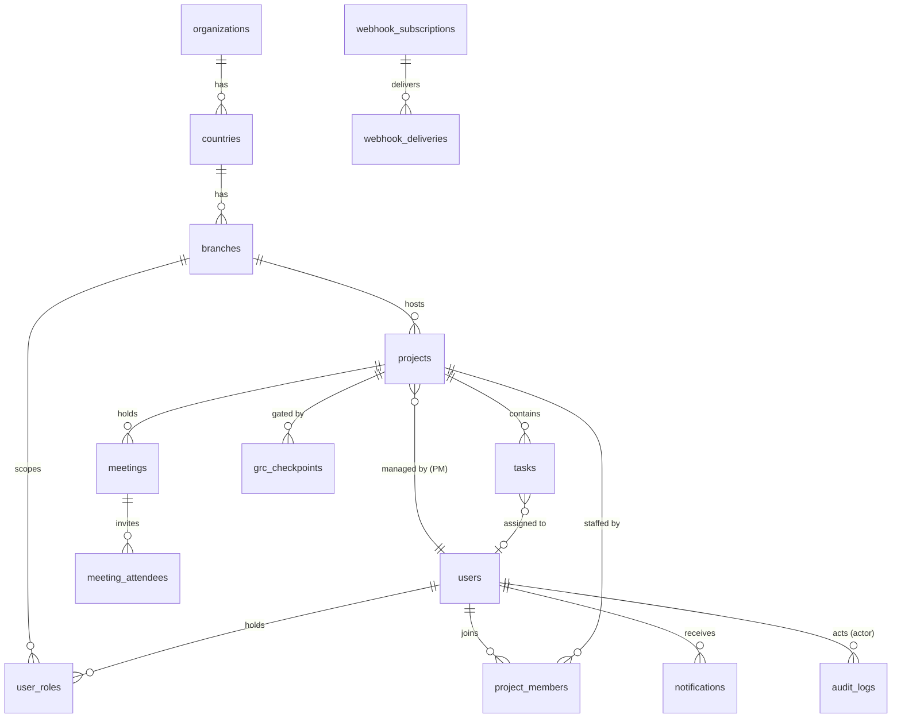

# ITPM360 — Proposed PostgreSQL Schema

Source of truth: [`server/migrations/001_initial_schema.sql`](../server/migrations/001_initial_schema.sql). Validated against PostgreSQL 16.

## Entity relationship diagram

## Hierarchy tables

| Table | Purpose | Key columns |
|---|---|---|
| `organizations` | Global organization root (usually one row) | `name` |
| `countries` | Countries within the org | `iso_code` (unique per org) |
| `branches` | Local branches within a country | `code` (unique per country), `timezone` (IANA — drives local deadline notifications) |

## Users and RBAC

- **`users`** — identity: `email` (citext, case-insensitive unique), `full_name`, `password_hash` (bcrypt), `is_active`.
- **`user_roles`** — scoped role assignments. A user can hold **multiple roles at different scopes**:
  - `global_admin` → no scope (org-wide, `branch_id IS NULL` enforced by CHECK)
  - `branch_manager`, `project_manager`, `viewer` → scoped to a `branch_id` (CHECK-enforced)
  - Project-level assignment is separate: the PM lives on `projects.project_manager_id`; team membership on `project_members`.

This design lets one person be, e.g., Branch Manager in Germany and Viewer in France, without duplicating user records.

## Projects and GRC

- **`projects`** — `branch_id`, `name`, `description`, `project_manager_id` (RESTRICT delete — a project always has an accountable PM), **`rag_status`** (`green | amber | red`), lifecycle `status`, `start_date`/`end_date` (CHECK: end ≥ start), `budget`.
- **`project_members`** — team members with a free-form `member_role` (developer, analyst, QA...).
- **`grc_checkpoints`** — Governance / Risk / Compliance gates in the lifecycle: `checkpoint_type`, `status` (`pending → in_review → approved/rejected/waived`), `due_date`, `reviewed_by`, `reviewed_at`, `notes`.

## Tasks (with blocker mechanics)

- **`tasks`** — `assignee_id`, `status` (`todo | in_progress | blocked | in_review | done`), `priority`, `start_date`/`due_date`, `completed_at`, `sort_order` (Kanban ordering), plus the two dedicated fields:
  - **`blocker_explanation`** — DB CHECK constraint: a task cannot be `blocked` without an explanation.
  - **`next_steps`** — feeds the meeting agenda automatically.
- Partial index on `due_date WHERE status <> 'done'` keeps the deadline-notification scan cheap.

## Meeting Hub

- **`meetings`** — linked to a project; `scheduled_at`, `duration_minutes`, `location`/`meeting_link`, `status`, `minutes`.
  - **`agenda_snapshot` (jsonb)** — the auto-generated agenda (current RAG status, blocked tasks with reasons, next steps) is computed live from `projects` + `tasks` while the meeting is upcoming, then frozen into this column when the meeting completes — so historical meetings preserve the exact context discussed.
- **`meeting_attendees`** — invited / attended / absent per user.

## Compliance, notifications, integrations

- **`audit_logs`** — append-only: `actor_id`, `action` enum (`create/update/delete/status_change/login/export`), `entity_type`+`entity_id`, `changes` jsonb (`{before, after}` of changed fields only), `ip_address`. Indexed by entity, actor, and time for compliance queries.
- **`notifications`** — per-user inbox: `type` (`task_blocked`, `rag_downgrade`, `deadline_approaching`, `task_assigned`, `meeting_scheduled`, `grc_checkpoint_due`), deep-link via `entity_type`/`entity_id`, partial index on unread.
- **`webhook_subscriptions` / `webhook_deliveries`** — outbound integration: HMAC `secret`, subscribed `events` array, delivery log with response status and retry `attempts` (delivery engine lands in Phase 5; schema is defined up front so nothing needs re-migration).

## Later migrations

- **002** — `task_dependencies` (finish-to-start), `task_comments`, `tasks.is_milestone`, `tasks.estimate_hours`.
- **003** — `risks` (RAID register: category, likelihood/impact/`severity` generated column, status, owner, mitigation), `time_entries` (hours logged per task/user/date), `tasks.tags` (gin-indexed), `notification_type += risk_raised`.
- **004** — `projects.actual_cost` and `tasks.percent_complete` (EVM inputs; earned value is computed, not stored).

## Conventions

- UUID primary keys (`gen_random_uuid()`) everywhere except append-only logs (`bigint` identity).
- `created_at`/`updated_at` timestamps with a shared `set_updated_at()` trigger.
- `ON DELETE CASCADE` down the hierarchy; `SET NULL` for authorship references; `RESTRICT` for the accountable PM.
- Forward-only SQL migrations tracked in `schema_migrations`, applied via `npm run migrate`.

## Open questions for review

1. **Budget/currency** — `budget numeric(14,2)` has no currency column. Add `currency char(3)` per project, or standardize on one reporting currency?
2. **RAG history** — RAG downgrades will be reconstructable from `audit_logs`; if trend charts need fast access, a dedicated `project_rag_history` table could be added in Phase 4.
3. **Task dependencies** — Gantt charts can render from start/due dates alone; if you want dependency arrows (finish-to-start links), a `task_dependencies` table would be added in Phase 3.
4. **Country-level roles** — RBAC currently scopes to branch or global. Should a role also be assignable at country level (e.g., a country director seeing all branches in their country)?
